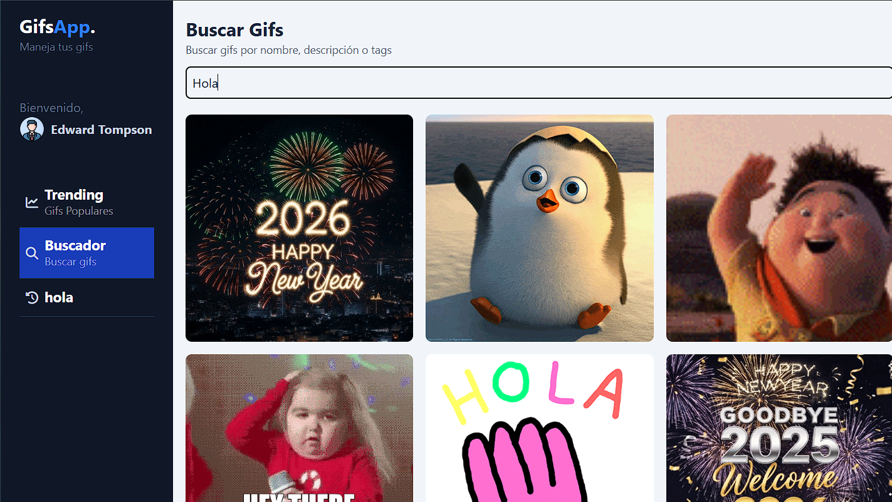
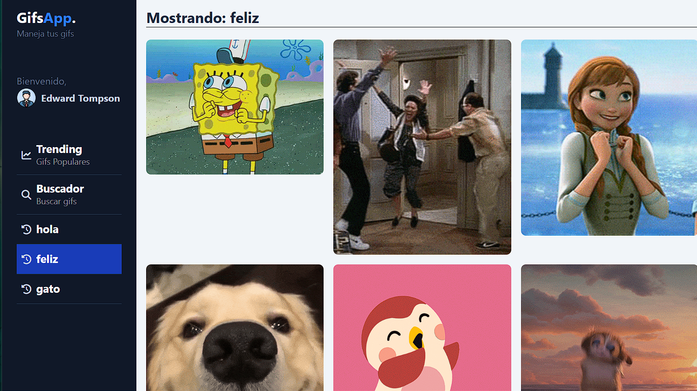

# 🎬 Gifs App

Aplicación web para buscar y visualizar GIFs animados utilizando la API de Giphy. Proyecto desarrollado con Angular 19 como parte de mi aprendizaje en desarrollo frontend.


## 🚀 Demo

🔗 **[Ver demo en vivo](https://dgs-gifs-app.netlify.app/dashboard/trending)**

## ✨ Características

- 🔍 Búsqueda de GIFs en tiempo real
- 💾 Historial de búsquedas
- ⚡ Carga rápida y optimizada
- 🎨 Interfaz intuitiva y moderna

## 🛠️ Tecnologías

- Angular 19
- TypeScript
- Giphy API
- CSS3 / Tailwind
- Netlify (deployment)

## 📦 Instalación

1. Clona el repositorio:
```bash
git clone https://github.com/tu-usuario/gifs-app-repaso.git
```

2. Instala las dependencias:
```bash
cd gifs-app-repaso
npm install
```

3. Inicia el servidor de desarrollo:
```bash
ng serve
```

4. Abre tu navegador en `http://localhost:4200/`

## 🔑 API Key

Este proyecto utiliza la API pública de Giphy. La API key está incluida en el código para propósitos de demostración. Si deseas usar tu propia key:

1. Obtén una API key gratuita en [Giphy Developers](https://developers.giphy.com/)
2. Reemplaza el valor en `src/environments/`

## 📸 Screenshots

### Pantalla principal


### Resultados de búsqueda


### Historial


## 🎓 Aprendizajes

Este proyecto fue desarrollado como parte del curso Angular: De cero a experto de Udemy, donde practiqué:

- Consumo de APIs REST
- Gestión de estado en Angular
- Componentes y módulos
- Servicios e inyección de dependencias
- Buenas prácticas de desarrollo


